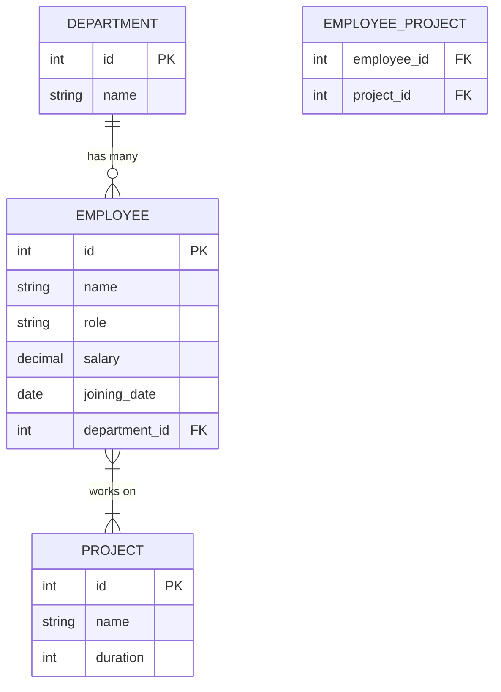

# 5.2 Database Artifacts

This document details the database schema and related artifacts for the project.

## SQL Schema Creation Scripts
The primary SQL schema script is used to initialize the database tables (Employee, Department, Project, and the junction table).
- **Schema Script**: [./employee-service/src/main/resources/schema.sql](./employee-service/src/main/resources/schema.sql)
- **Monolith Schema Script**: [./ems-monolith/src/main/resources/schema.sql](./ems-monolith/src/main/resources/schema.sql)

## Sample Data Insertion Scripts
Real sample data for all tables (Department, Employee, Project, Employee_Project) is provided in the `data.sql` script.
- **Data Insertion Script**: [./employee-service/src/main/resources/data.sql](./employee-service/src/main/resources/data.sql)
- **Employee Sample Data (CSV)**: [./employees.csv](./employees.csv)

## ER Diagram
Below are the Entity Relationship Diagrams for the system.

### Visual ER Diagrams
- **Conceptual ER Diagram**: [./Employee Management ER Daigram.png](./Employee%20Management%20ER%20Daigram.png)
- **Database Schema ER Diagram**: [./ER Daigram.png](./ER%20Daigram.png)

### Mermaid ER Diagram

The diagram illustrates the relationships:
- **Department to Employee**: One-to-Many relationship.
- **Employee to Project**: Many-to-Many relationship managed through a junction table (`employee_project`).
