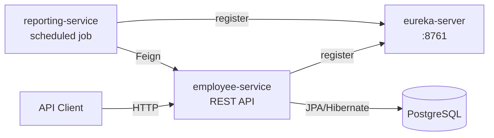

# Employee Management System (EMS) — Project Report

**Workspace**: `employee-management-system`  
**Date**: 2026-03-03  
**Tech**: Java 17, Spring Boot 3.2.2, Spring Cloud 2023.0.0, Maven, JPA/Hibernate, PostgreSQL (primary), H2 (optional), OpenAPI (springdoc), JaCoCo, Python analytics (Pandas + scikit-learn)

---

## 1. Executive Summary

This project implements an **Employee Management System** with CRUD operations for **Employees**, **Departments**, and **Projects**, plus **analytics/reporting**. It is delivered in two deployment styles:

- **Monolith** (`ems-monolith`): single Spring Boot app exposing all REST APIs and running scheduled reporting tasks.
- **Microservices** (`eureka-server`, `employee-service`, `reporting-service`): service discovery via Eureka, an Employee API service, and a Reporting service that periodically fetches data using Feign.

Additionally, a **Python analytics module** produces data insights and optional ML outputs (linear regression + clustering) and exports reports.

---

## 2. Repository Structure

Root Maven parent POM (`pom.xml`) defines four modules:

- `eureka-server`: Netflix Eureka registry (service discovery)
- `employee-service`: employee/department/project APIs (microservice)
- `reporting-service`: scheduled reporting + Feign client (microservice)
- `ems-monolith`: standalone monolith version + JaCoCo configuration

---

## 3. High-Level Architecture

### 3.1 Monolith Mode

```mermaid
flowchart LR
  Client[API Client\n(Postman / Browser / Frontend)] -->|HTTP| Monolith[ems-monolith\nSpring Boot REST API]
  Monolith -->|JPA/Hibernate| DB[(PostgreSQL)]
  Monolith --> Scheduler[Scheduled Task\nReportGeneratorService]
```

### 3.2 Microservices Mode



---

## 4. Runtime Configuration (Ports & Service Names)

### 4.1 `ems-monolith`

- **Port**: `8080` (`ems-monolith/src/main/resources/application.properties`)
- **Eureka**: explicitly disabled
- **DB (PostgreSQL example)**:
  - `jdbc:postgresql://localhost:5432/MYDB`
  - user: `postgres`
  - password: `root`
- **Scheduled report**: `ems.report.fixed-rate=60000` (ms)

### 4.2 `eureka-server`

- **Port**: `8761`
- **Registers with itself**: disabled (standard server config)

### 4.3 `employee-service`

- **Port**: `8081`
- **Service name**: `employee-service`
- **Eureka defaultZone**: `http://localhost:8761/eureka`
- **DB (PostgreSQL example)**: same `MYDB` settings

### 4.4 `reporting-service`

- **Port**: `8082`
- **Service name**: `reporting-service`
- **Eureka defaultZone**: `http://localhost:8761/eureka/`
- **Feign target**: `@FeignClient(name = "employee-service")`
- **Scheduled job**: `fixedRate = 60000` ms

---

## 5. Domain Model (Entities)

Core entities exist in `com.company.ems.model`:

- **Department**: one-to-many with Employee
- **Employee**:
  - many-to-one with Department
  - many-to-many with Project via `employee_project`
  - implements `Comparable<Employee>` for **natural sorting by salary**
- **Project**: many-to-many with Employee

The deliverables include an ER diagram (see `deliverables/5.2_Database_Artifacts.md`).

---

## 6. REST API Summary (Monolith)

The monolith controllers are in:
- `ems-monolith/src/main/java/com/company/ems/controller/EmployeeController.java`
- `ems-monolith/src/main/java/com/company/ems/controller/DepartmentController.java`
- `ems-monolith/src/main/java/com/company/ems/controller/ProjectController.java`

### 6.1 Employees (`/employees`)

- `POST /employees`: create employee (department + projects supported via DTO)
- `GET /employees/{id}`: get employee by id
- `GET /employees?department={name}&page={p}&size={s}`: list with optional department filter + pagination
- `GET /employees/sorted`: custom sort (name + joining date via comparator)
- `GET /employees/sorted-by-salary`: natural sort (salary via `Comparable`)
- `PUT /employees/{id}`: update employee
- `DELETE /employees/{id}`: delete employee

### 6.2 Departments (`/departments`)

- `POST /departments`
- `GET /departments/{id}`
- `GET /departments`
- `PUT /departments/{id}`
- `DELETE /departments/{id}`

### 6.3 Projects (`/projects`)

- `POST /projects`
- `GET /projects/{id}`
- `GET /projects`
- `PUT /projects/{id}`
- `DELETE /projects/{id}`

### 6.4 OpenAPI / Swagger UI

The project uses `springdoc-openapi-starter-webmvc-ui`. In typical Spring Boot 3 + springdoc 2.x setups, Swagger UI is available at:

- `/swagger-ui/index.html`

---

## 7. Reporting & Background Jobs

### 7.1 Monolith scheduled job

`ems-monolith/src/main/java/com/company/ems/service/ReportGeneratorService.java` runs a scheduled task:

- `@Scheduled(fixedRateString = "${ems.report.fixed-rate:60000}")`

### 7.2 Reporting-service scheduled job (microservices)

`reporting-service/src/main/java/com/company/reporting/service/ReportService.java`:

- Every minute, calls `employee-service` via Feign (`EmployeeClient.getSortedEmployees()`).
- Logs success/failure to stdout/stderr.

---

## 8. Python Analytics Module

There are analytics scripts in:

- `ems-monolith/python-analytics/analytics.py` (fetches from PostgreSQL and generates files under `reports/`)
- `employee-service/python-analytics/analytics.py` (generates sample CSV if missing, then analyzes)

Outputs include:

- `reports/analytics_report.json`
- `reports/department_salary_report.csv`
- `reports/salary_experience_plot.png` (monolith analytics)

ML concepts used:

- **Linear Regression**: salary prediction (supervised)
- **K-Means**: employee segmentation (unsupervised)

See: `employee-service/docs/AI_ML_REASONING.md`.

---

## 9. Testing & Quality

### 9.1 Unit/Integration Tests

Tests exist under `ems-monolith/src/test/java/...` including:

- controller tests (e.g., `EmployeeControllerTest`)
- service tests (e.g., `EmployeeServiceImplTest`)
- exception handler tests (e.g., `GlobalExceptionHandlerTest`)

### 9.2 Code Coverage (JaCoCo)

`ems-monolith` includes JaCoCo plugin execution bound to the `test` phase. The HTML report is generated at:

- `ems-monolith/target/site/jacoco/index.html`

---

## 10. How To Build & Run

### 10.1 Build all modules

From repo root:

```bash
mvn clean test
```

### 10.2 Run monolith

```bash
mvn -f ems-monolith/pom.xml spring-boot:run
```

### 10.3 Run microservices (recommended order)

1) Eureka:

```bash
mvn -f eureka-server/pom.xml spring-boot:run
```

2) Employee service:

```bash
mvn -f employee-service/pom.xml spring-boot:run
```

3) Reporting service:

```bash
mvn -f reporting-service/pom.xml spring-boot:run
```

---

## 11. Known Gaps / Notes

- A top-level `requirement.txt` is referenced by deliverables docs, but is **not present** in this workspace snapshot. The implemented requirement mapping is documented in `employee-service/MODULE_1_3_REVIEW.md`.
- The repo currently includes build artifacts under `*/target/` which should typically be excluded from git via `.gitignore`.

---

## 12. Suggested Improvements (Optional)

- Add a **Gateway** (Spring Cloud Gateway) for microservices routing.
- Replace stdout logging in reporting-service with structured logging (SLF4J) + persistence of reports.
- Add Docker Compose for PostgreSQL + services to simplify local setup.
- Add CI workflow (GitHub Actions) to run tests + publish JaCoCo report.

